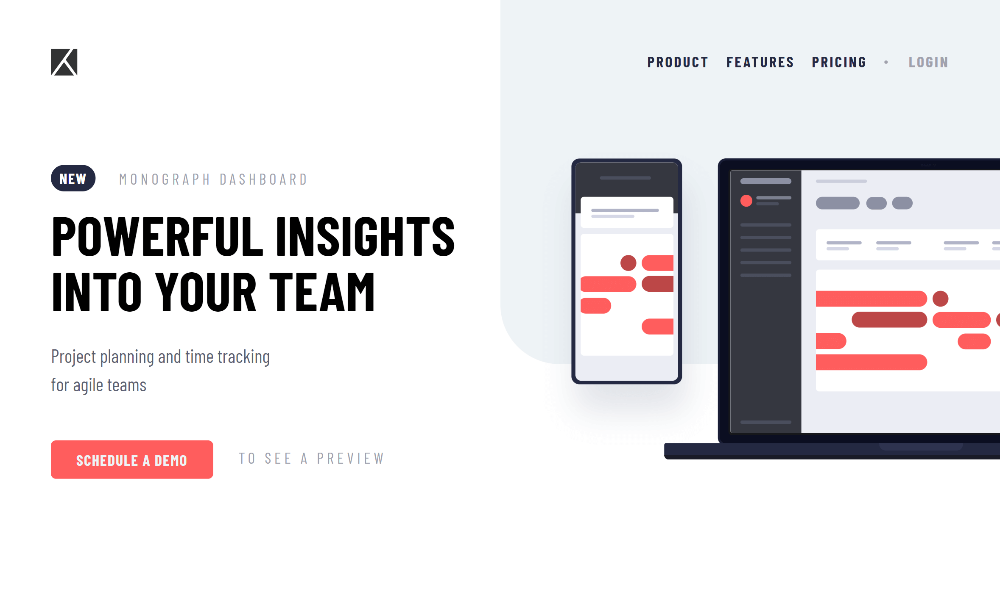

# Frontend Mentor - Project tracking intro component

This is a solution to the [project tracking intro component challenge on Frontend Mentor](https://www.frontendmentor.io/challenges/project-tracking-intro-component-5d289097500fcb331a67d80e). Frontend Mentor challenges help you improve your coding skills by building realistic projects.

Difficulty: `junior`

## Table of contents

- [Frontend Mentor - Project tracking intro component](#frontend-mentor---project-tracking-intro-component)
  - [Table of contents](#table-of-contents)
  - [Deployment status](#deployment-status)
  - [Overview](#overview)
    - [The challenge](#the-challenge)
    - [Links](#links)
  - [My process](#my-process)
    - [Built with](#built-with)
    - [What I learned](#what-i-learned)
    - [Continued development](#continued-development)
    - [Useful resources](#useful-resources)
  - [Project information](#project-information)
    - [User stories and features](#user-stories-and-features)
  - [Author](#author)

## Deployment status

## Overview

### The challenge

To build the project tracking intro component according to the given designs as close as possible.
The users should be able to:

- View the optimal layout for the site depending on their device's screen size
- See hover states for all interactive elements on the page

### Links

- Solution URL: [Open GitHub repository](https://github.com/YariMorcus/fm-project-tracking-intro-component)
- Live Site URL: [open Netlify](https://project-tracking-intro-yari-morcus.netlify.app)

## My process

### Built with

- Semantic HTML5 markup
- CSS _(BEM naming convention used, [see getbem.com](http://getbem.com) for more information)_
- Flexbox
- ES6 classes
- Mobile-first workflow
- Optimized for both Open Graph (Facebook) and Twitter Cards
- [Node.js](https://nextjs.org/) - Open source and multi platform JavaScript runtime environment
- [NPM](https://www.npmjs.com/) - Package Manager for Node JavaScript platform
- [Parcel](https://parceljs.org/) - Zero configuration build tool / module bundler to automate workflow
- [Sass](https://sass-lang.com/) - CSS Preprocessor (in collaboration with Parcel)
- [GitHub](https://github.com/) - Technological platform based on Git
- [Git](https://git-scm.com/) - Free and open source distributed version control system
- [Netlify](https://www.netlify.com/) - Free service to host static webpages and web applications

### What I learned

1. Always use semantic compliant-standard HTML
2. To implement an accessible mobile navigation with progressive enhancement
3. To keep testing the application for Web Accessibility
4. How to add a decorative image that should align to the side of the webpage [^1]
5. To spend time looking at the details of the designs to create the application as accurately as possible
6. How to solve problems with a framework _(provided by a [course](https://www.udemy.com/course/the-complete-javascript-course/) I followed)_

[^1]: This was more difficult to achieve because I could not get it working with a regular `` due to a constant unwanted overflow.

### Continued development

The way I want to continue to develop myself is by focusing on laying out a proper foundation of HTML, CSS, and JavaScript.
This so I can build quality websites for clients by just using the core languages of the Web.
At the present, I am working on the above things by going through (interactive) articles on the MDN Web Docs (see chapter [Useful resources](#useful-resources)).

Another way I want to improve my knowledge of these subjects is to do more challenges that [Frontend Mentor](https://www.frontendmentor.io/challenges) is offering, starting at the lowest level, and building that up to the more advanced ones.

Besides the above, I want to continue to develop myself by using several tools more often to improve my workflow. and spend less time doing things that can be automated.

A few tools that I will start using more often are:

1. Gulp
2. Parcel
3. Git
4. GitHub
5. Netlify (in combination with Continues Deployment)

_I will learn the above points in between but do not want to focus too much on those at the moment._

As soon as I am capable of creating quality websites with the core languages of the Web, I will start to learn JavaScript libraries and frameworks. Both of these change over time, so I do not want to spend my time on those before I have a solid understanding of prior mentioned languages.

### Useful resources

- [Transfonter](https://transfonter.org) - Has been used to convert the downloaded font files to woff and woff2 (most recent font formats, supported in all major browsers), and generate the corresponding `@font-face` css rulesets
- [Frontend Mentor - Project tracking intro component challenge](https://www.frontendmentor.io/challenges/project-tracking-intro-component-5d289097500fcb331a67d80e)

## Project information

### User stories and features

1. As a user, I want to be able to navigate to pages on mobile so I can discover more content

   **Feature**: A toggle button that opens a mobile navigation

[//]: # 'Optional: ### Flowchart'
[//]: # 'Optional: insert flowchart link below'

## Author

- LinkedIn - [Yari Morcus](https://www.linkedin.com/in/yarimorcus) _(must be logged in)_
- Frontend Mentor - [@YariMorcus](https://www.frontendmentor.io/profile/YariMorcus)
